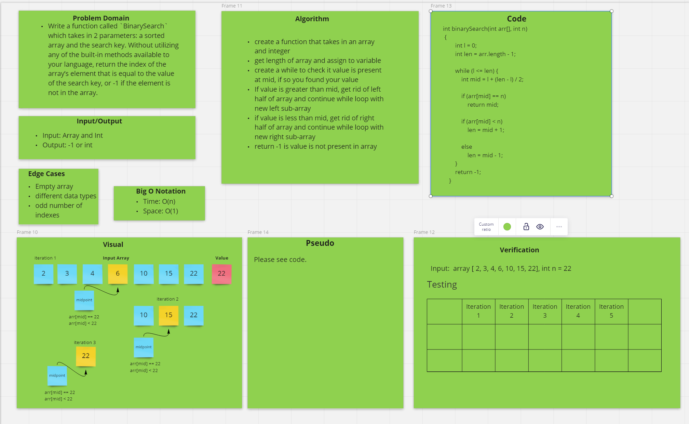

# Code Challenge: Class 03

## Specifications

- Read all of the following instructions carefully.
- Name things exactly as described.
- Do all your work in a public repository called **data-structures-and-algorithms**.
- Create a new branch in your repo called **array-binary-search**.
- Make a directory for this challenge, named according to your language’s conventions, containing a README.md file.
- Update the “Table of Contents” - in the README at the root of the repository - with a link to this challenge’s README file.
- **NOTE:** This challenge is whiteboard only
- Write out code as part of your whiteboard process, but don’t worry about          creating external program files.

### Feature Tasks

- Write a function called `BinarySearch` which takes in 2 parameters: a sorted array and the search key. Without utilizing any of the built-in methods available to your language, return the index of the array’s element that is equal to the value of the search key, or -1 if the element is not in the array.
- **NOTE**: The search algorithm used in your function should be a binary search.

Check the Resources section for details
### Example

- Input: [2, 4, -8], 5
- Output [1, 4, 5, 6, -8]

### Stretch Goal

- Write a second function that removes an element from the middle index and shifts other elements in the array to fill the new gap.

### Structure and Testing

Utilize the Single-responsibility principle: any methods you write should be clean, reusable, abstract component parts to the whole challenge. You will be given feedback and marked down if you attempt to define a large, complex algorithm in one function definition.

