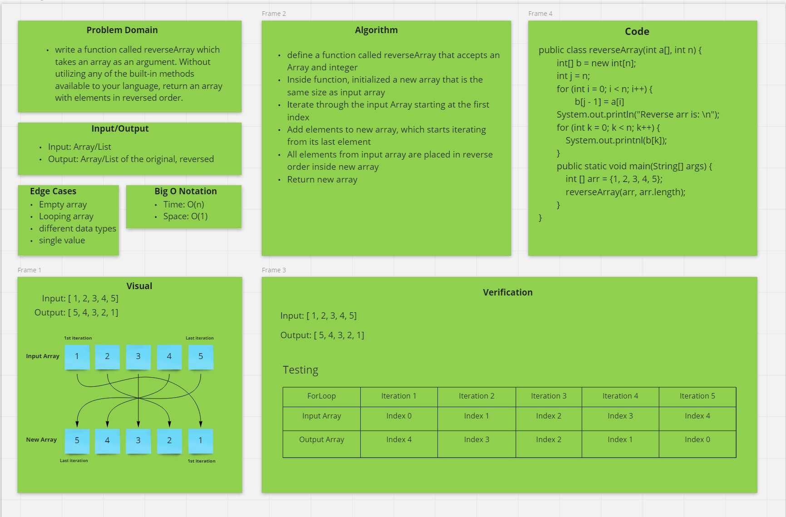

# Code Challenge: Array Reverse

## Specifications

- Read all of the following instructions carefully.
- Name things exactly as described.
- Do all your work in a public repository called **data-structures-and-algorithms**.
- Create a new branch in your repo called **array-reverse**.
- Make a directory for this challenge, named according to your language’s conventions, containing a README.md file.
- Update the “Table of Contents” - in the README at the root of the repository - with a link to this challenge’s README file.
- **NOTE:** This challenge is whiteboard only
- Write out code as part of your whiteboard process, but don’t worry about          creating external program files.

### Feature Tasks

- Write a function called reverseArray which takes an array as an argument. Without utilizing any of the built-in methods available to your language, return an array with elements in reversed order.

### Example

- Input: [1, 2, 3, 4, 5, 6]
- Output [6, 5, 4, 3, 2, 1]

### Structure and Testing

Utilize the Single-responsibility principle: any methods you write should be clean, reusable, abstract component parts to the whole challenge. You will be given feedback and marked down if you attempt to define a large, complex algorithm in one function definition.

### Stretch Goal

Once you’ve achieved a working solution, implement the same feature with a different methodology. (Hint: what different techniques do you have when working with arrays? Recursion, loops, indexes, modifying the array input directly…)

In other words, use a different algorithm & pseudocode to solve the same problem. Then compare approaches for efficiency, readability, flexibility, etc.

