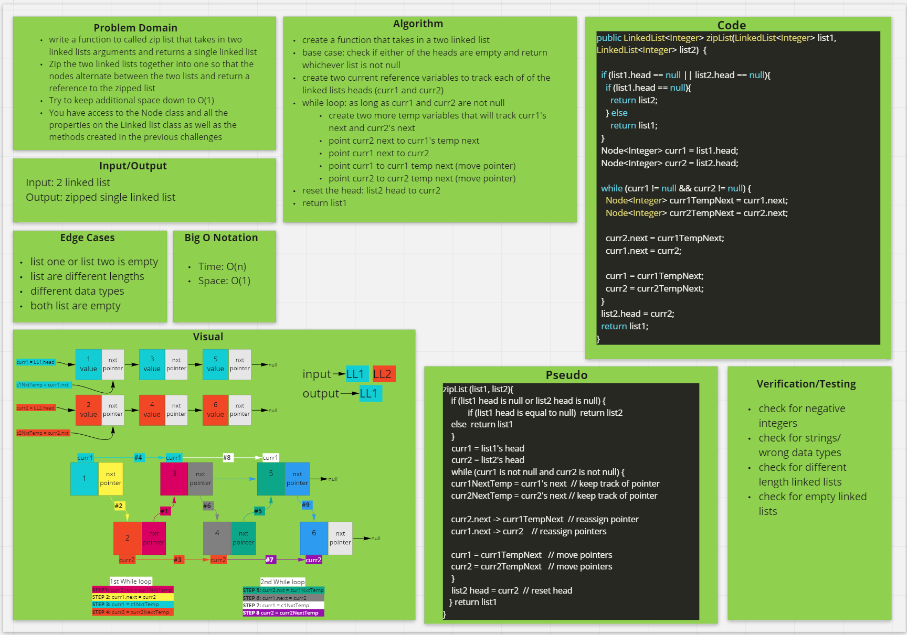

# Linked List Zipped

- Zip two Linked Lists

## Feature Tasks

- Write a function called zip lists
  - Arguments: 2 linked lists
  - Return: New Linked List, zipped as noted below
  - Zip the two linked lists together into one so that the nodes alternate between the two lists and return a
    reference to the zipped list.
  - Try and keep additional space down to O(1)
  - You have access to the Node class and all the properties on the Linked List class as well as the methods created
    in previous challenges.

## Approach & Efficiency

- I decided to use a `while` loop to traverse through the linked lists.
- First, I set a simple conditional statement to check if either one of the lists are empty.
- If we have an empty list, return the other list.
- Once confirmed that we have two valid linked list, assign two reference variables (`curr1` & `curr2`) - one for
  each of the linked lists - which points to their heads.
- We use these variables to move through the lists by reassigning them to their respective next pointers.
- I also used two temp next variables which hold a reference to `curr1.next` and `curr2.next`
- I'm basically swapping the `.next` pointers, so `curr1.next` gets pointed to `curr2`, `curr2.next` gets pointed to
  `curr1.next`, then I traverse to the next node of each linked list just like you would a standard singly linked
  list `curr = curr.next` and repeat until the while conditional becomes false.

## Time & Space Complexity
  - Time: O(n)
  - Space: O(1)
  
## Whiteboard

