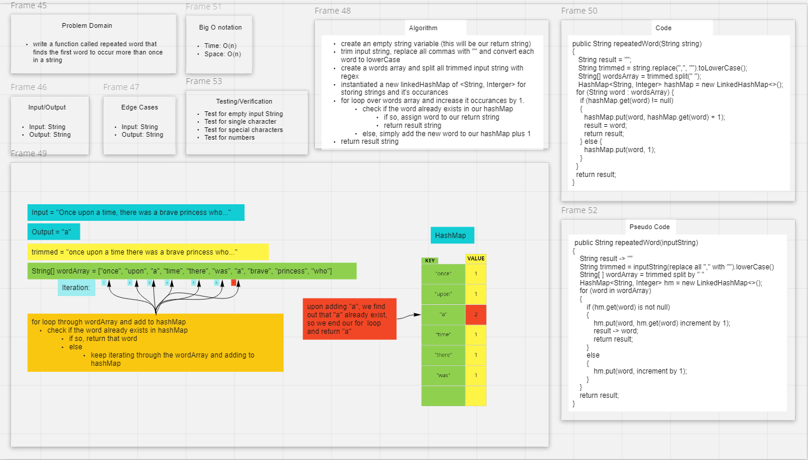

# Code Challenge

- Find the first repeated word in a book.

### Feature Tasks

- Write a function called repeated word that finds the first word to occur more than once in a string
  - Arguments: string
  - Return: string

### Approach & Efficiency

`repeatedWord()`
  - pass in string containing words as an arg
  - remove all comas, convert to lowerCase and split string - save to wordArray
  - for each word in the wordArray, check if word exist in hashMap, if so return the word
  - else add the new word to hashMap
  - return empty string
  -
### Code

```
public class RepeatedWord {
  public String repeatedWord(String string) {
    String result = "";
    String trimmed = string.replace(",", "").toLowerCase();
    String[] wordsArray = trimmed.split(" ");
    HashMap<String, Integer> hashMap = new LinkedHashMap<>();
    for (String word : wordsArray) {
      if (hashMap.get(word) != null)
      {
        hashMap.put(word, hashMap.get(word) + 1);
        result = word;
        return result;
      } else {
        hashMap.put(word, 1);
      }
    }
    return result;
  }

```

### Example

- Input: `"Once upon a time, there was a brave princess who..."`
- Output: `"a"`

- Input: `"It was the best of times, it was the worst of times, it was the age of wisdom, it was the age of foolishness, it was the epoch of belief, it was the epoch of incredulity, it was the season of Light, it was the season of Darkness, it was the spring of hope, it was the winter of despair, we had everything before us, we had nothing before us, we were all going direct to Heaven, we were all going direct the other way – in short, the period was so far like the present period, that some of its noisiest authorities insisted on its being received, for good or for evil, in the superlative degree of comparison only..."`
-Output: `"it"`

- Input: `"It was a queer, sultry summer, the summer they electrocuted the Rosenbergs, and I didn’t know what I was doing in New York..."`
- Output: `"summer"`


### Whiteboard


