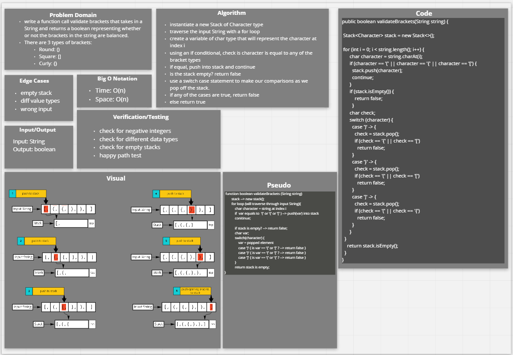

# Implement a Queue using two Stacks.

## Specifications

### Challenge Type: Code Challenge / Algorithm

### Feature Tasks

- Create a new class called pseudo queue.
- Do not use an existing Queue.
- Instead, this PseudoQueue class will implement our standard queue interface (the two methods listed below),
- Internally, utilize 2 Stack instances to create and manage the queue

### Methods:

  - enqueue
    - Arguments: value
    - Inserts value into the PseudoQueue, using a first-in, first-out approach.

  - dequeue
    - Arguments: none
    - Extracts a value from the PseudoQueue, using a first-in, first-out approach.h
    NOTE: The Stack instances have only push, pop, and peek methods. You should use your own Stack implementation. Instantiate these Stack objects in your PseudoQueue constructor.

### Example

```enqueue(value)
Input	Args	Output
[10]->[15]->[20]	5	[5]->[10]->[15]->[20]
5	[5]
dequeue()
Input	Output	Internal State
[5]->[10]->[15]->[20]	20	[5]->[10]->[15])
[5]->[10]->[15]	15	[5]->[10]
```
### Whiteboard


# Multi-bracket Validation

## Feature Tasks

- Write a function called validate brackets
  - Arguments: string
  - Return: boolean
    - representing whether or not the brackets in the string are balanced
      T
      There are 3 types of brackets:

- Round Brackets : ()
- Square Brackets : []
- Curly Brackets : {}

- Example
-
```
  Input	Output
  {}	TRUE
  {}(){}	TRUE
  ()[[Extra Characters]]	TRUE
  (){}[[]]	TRUE
  {}{Code}[Fellows](())	TRUE
  [({}]	FALSE
  (](	FALSE
  {(})	FALSE
```

  Consider these small examples and why they fail.

Input	Output	Why
{	FALSE	error unmatched opening { remaining.
)	FALSE	error closing ) arrived without corresponding opening.
[}	FALSE	error closing }. Doesn’t match opening (.

### Whiteboard

