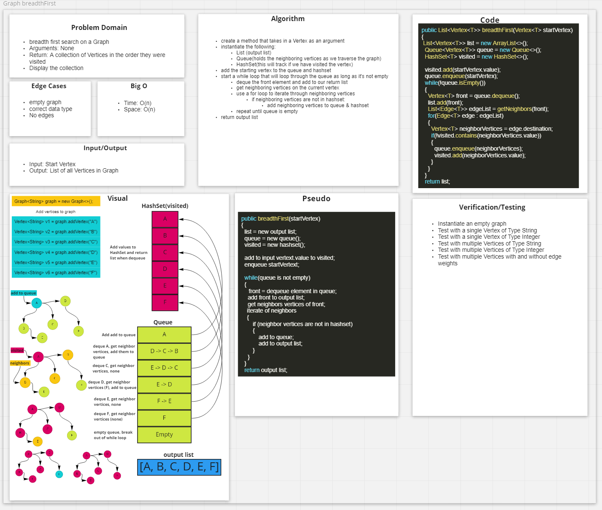

# Graphs

- A graph is a non-linear data structure that is used to store data in the form of Vertices(Nodes) and Edges(connections) between those Vertices.
- A good example of a graph is an Airports, where the hubs represent Vertices and flights represent the Edges connecting to other airports.
- Weights can be added to Edges in the graph, which in the airport example, can represent the flights times.

## Features

- Implement your own Graph. The graph should be represented as an adjacency list (HashMap), and should include the following methods:

### Methods

#### addVertex(T value)

- Arguments: value
- Returns: The added vertex(node)
- Adds a vertex to the graph

```
  public Vertex<T> addVertex(T value)
  {
    Vertex<T> vertex = new Vertex<>(value);
    if(adjacencyLists.get(vertex) == null)
    {
    adjacencyLists.put(vertex, new LinkedList<>());
    numberOfVertices++;
    }
    return vertex;
  }
```

#### addEdge(Vertex<T> start, Vertex<T> destination, int weight)

- Arguments: 2 vertices to be connected by the edge, weight (optional)
- Returns: nothing
- Adds a new edge between two vertices in the graph
- If specified, assign a weight to the edge
- Both nodes should already be in the Graph

```
  public void addEdge(Vertex<T> start, Vertex<T> destination)
  {
    addEdge(start, destination, 0);
  }

  public void addEdge(Vertex<T> start, Vertex<T> destination, int weight)
  {
    Edge<T> edge = new Edge<>(destination, weight);
    if (adjacencyLists.get(start) == null)
    {
      LinkedList<Edge<T>> linkedList = new LinkedList<>();
      linkedList.add(edge);
      adjacencyLists.put(start, linkedList);
    } else
    {
      LinkedList<Edge<T>> linkedList = adjacencyLists.get(start);
      linkedList.add(edge);
      adjacencyLists.put(start, linkedList);
    }
  }
```

#### getVertices()

- Arguments: none
- Returns all the vertices in the graph as a collection (set, list, or similar)

```
  public List<Vertex<T>> getVertices()
  {
    return new ArrayList<>(adjacencyLists.keySet());
  }
```

#### getNeighbors(Vertex<T> vertex)

- Arguments: node
- Returns a collection of edges connected to the given vertex
  - Include the weight of the connection in the returned collection

```
public List<Edge<T>> getNeighbors(Vertex<T> vertex)
  {
    LinkedList<Edge<T>> linkedList = adjacencyLists.get(vertex);
    return new ArrayList<>(linkedList);
  }
```

#### size()

- Arguments: none
- Returns the total number of nodes in the graph

```
 public int size()
  {
    return numberOfVertices;
  }
```

#### breadthFirst(Vertex<T> startVertex)

- Argument: Vertex
- Return: A collection of vertices in the order they were visited
- Display the collection

```
  public List<Vertex<T>> breadthFirstSearch(Vertex<T> startVertex)
  {
    List<Vertex<T>> list = new ArrayList<>();
    Queue<Vertex<T>> queue = new Queue<>();
    HashSet<T> visited = new HashSet<>();

    visited.add(startVertex.value);
    queue.enqueue(startVertex);
    while(!queue.isEmpty())
    {
      Vertex<T> front = queue.dequeue();
      list.add(front);
      List<Edge<T>> edgeList = getNeighbors(front);
      for(Edge<T> edge : edgeList)
      {
        Vertex<T> neighborVertices = edge.destination;
        if(!visited.contains(neighborVertices.value))
        {
          queue.enqueue(neighborVertices);
          visited.add(neighborVertices.value);
        }
      }
    }
    return list;
  }
```

#### depthFirst(Vertex<T> startVertex)

- Argument: Vertex startVertex
- Return: A collection of vertices in their pre-order depth-first-search traversal order
- Display the collection

```
 WORK IN PROGRESS...
```
## Approach & Efficiency

- `addNode()`
  - Time: O(1)
  - Space: O(1)

- `addEdge()`
  - Time: O(1)
  - Space: O(1)

- `getNodes()`
  - Time: O(n)
  - Space: O(n)

- `getNeighnors()`
  - Time: O(1)
  - Space: O(1)

- `breadthFirst()`
  - Time:
  - Space:

- `size()`
  - Time: O(1)
  - Space: O(1)

- `breadthFirst()`
  - Time: O(n)
  - Space: O(n)

- `depthFirst()`
  - Time:
  - Space:

### Whiteboards




### Sources

[Graphs](https://codefellows.github.io/common_curriculum/data_structures_and_algorithms/Code_401/class-35/resources/graphs.html)
