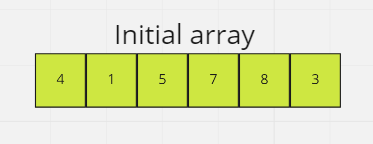
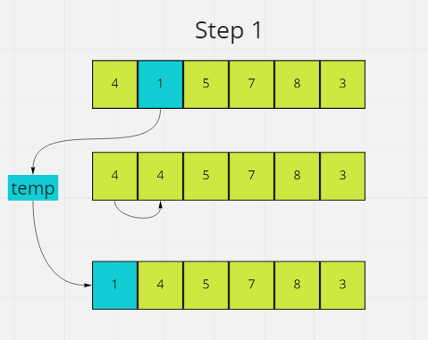
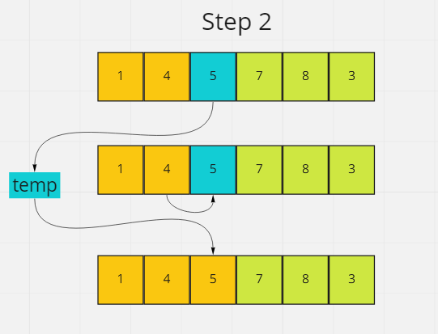
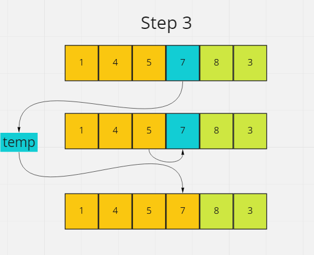
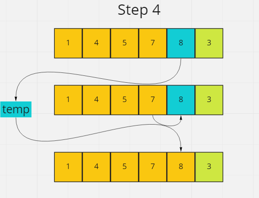
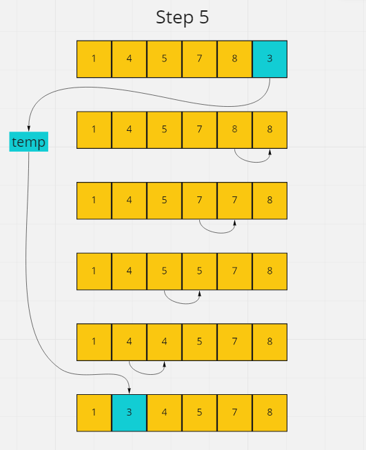

# Sort

## Insertion Sort

- Insertion sort works similarly to sorting a deck of cards
- We can assume the first card is already sorted, then we select another card and compare the value
- If the value is greater than our current sorted card, it's placed to the right.
- If the value is less than our current sorted card, it's placed to the left.

### Pseudocode
```
InsertionSort(int[] arr)

    FOR i = 1 to arr.length

      int j <-- i - 1
      int temp <-- arr[i]

      WHILE j >= 0 AND temp < arr[j]
        arr[j + 1] <-- arr[j]
        j <-- j - 1

      arr[j + 1] <-- temp
```
- Start with an unsorted array/list of integers



- The first element in the array is assumed to be sorted.
- Store the second element in a `temp` variable.
- Compare temp with the first element and if the first element is greater than temp, temp is placed in front of the first element.



- The first two elements are sorted.
- Compare the third element to the first two elements.
- It's greater than all element so it doesn't move.



- The first three elements are sorted.
- Compare the forth element to the third.
- 5 is less than 7, so we increment our indexes and move along.



- The first four elements are sorted.
- Compare the fifth element with the forth.
- 7 is less than 8, so we increment our indexes and move along.



- The first five elements are sorted.
- Compare the sixth element with the fifth.
- 3 is less than 8, so we swap
- Continue to compare `temp` with each element on the left of it until an element smaller than it is found.
- Place 3 behind 1 and the array is now completely sorted.



## Efficiency

- Time Complexity: O(n^2)
- Auxiliary Space: O(1)
