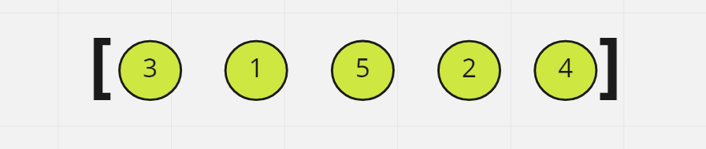
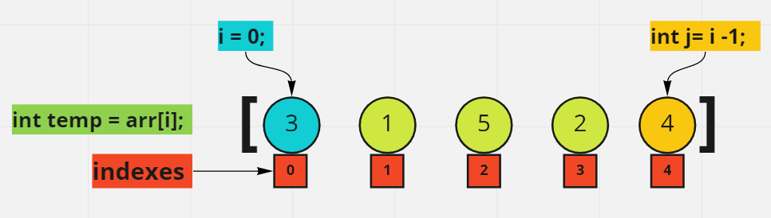
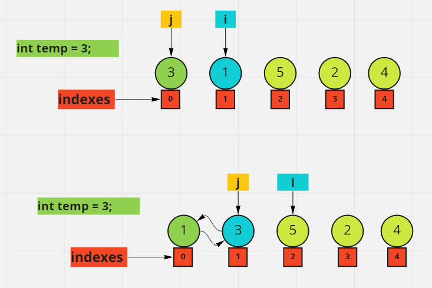

# Sort

## Insertion Sort

- Start with an unsorted array/list of integers

## For loop

- The Algorithm first compares the values at index i and index j
- i starts at index 0, while j starts at index 4. The i - 1 essentially "wraps" it back around to the end of our list
- we need to create a temp variable that will hold our array value at index i.

## While loop

- Now that we have our initial indexes setup, let's compare the values at those indexes.
- The while loop will only execute if both conditions are true.
- j needs to be greater than or equal to 0 AND our temp value is less than the value at j index.
  - Inside the while loop:
    - swap values: set arr[j + 1] = arr[j]
    - decrement j
  - assign temp to j's next index
  - move to the next for loop iteration.
-return the array

## Efficiency

- Time Complexity: O(n^2)
- Auxiliary Space: O(1)
