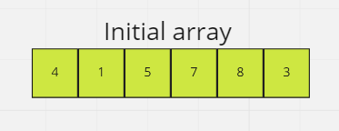
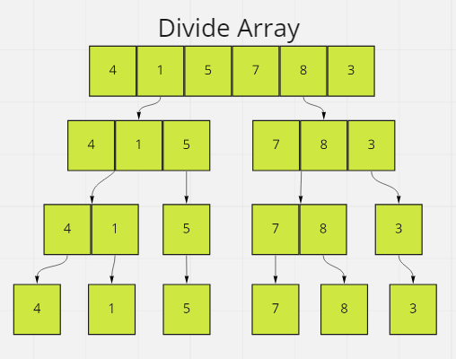
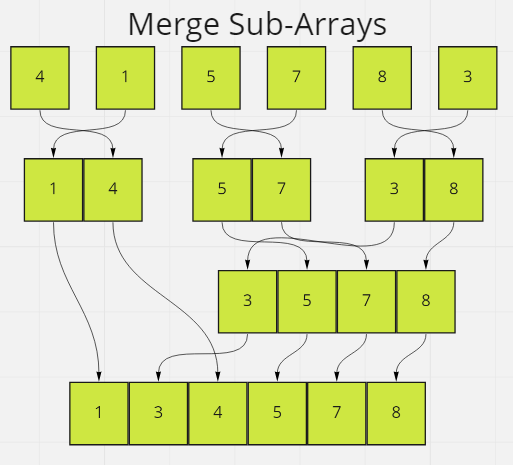

# Merge Sort

- Merge Sort is a divide and conquer sorting algorithm.
- It works by recursively dividing the problem into two or more sub-problems of the same or related type until they become simple enough to be solved.
- The solutions to the sub-problems are then reassembled to return a solution to the original problem.
- We'll be using an array and we'll start by breaking down that array into equals parts, then combine those sub-arrays in a sorted manner.

## Step 1

- If we only have one element in our array, it's already sorted. Simply return.
- For our example, we start with an unsorted array/list of integers.

## Step 2

- Divide the array recursively into two halves until we end up with single element arrays.

## Step 3

- Merge the smaller arrays into a new array in sorted order.

### Efficiency

- Time Complexity: O(Log n * n)
- Additional Space: O(n)
