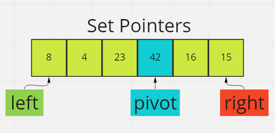

# Quick Sort

- Quick Sort is a divide and conquer sorting algorithm.
- Creates two empty arrays:
  - Left array holds values less than the pivot value.
  - Right array holds values greater than the pivot value.
- The Quick Sort algorithm has two basic operations:
  - swapping item in place.
  - partition a segment of the array.

### Pseudo Code

```
ALGORITHM QuickSort(arr, left, right)
    if left < right
        // Partition the array by setting the position of the pivot value
        DEFINE position <-- Partition(arr, left, right)
        // Sort the left
        QuickSort(arr, left, position - 1)
        // Sort the right
        QuickSort(arr, position + 1, right)

ALGORITHM Partition(arr, left, right)
    // set a pivot value as a point of reference
    DEFINE pivot <-- arr[right]
    // create a variable to track the largest index of numbers lower than the defined pivot
    DEFINE low <-- left - 1
    for i <- left to right do
        if arr[i] <= pivot
            low++
            Swap(arr, i, low)

     // place the value of the pivot location in the middle.
     // all numbers smaller than the pivot are on the left, larger on the right.
     Swap(arr, right, low + 1)
    // return the pivot index point
     return low + 1

ALGORITHM Swap(arr, i, low)
    DEFINE temp;
    temp <-- arr[i]
    arr[i] <-- arr[low]
    arr[low] <-- temp
```

## Step 1

- Find a pivot index in the input array- this will be the basic for comparision for the round.


## Step 2

- Create a left pointer starting at the first element in the array.



## Step 3

- Create a right pointer starting at the last element in the array.


## Step 4

- If the value at the left pointer is less than the pivot value, increment the left pointer by 1 (moves pointer to the right).
- Continue until the left pointer is more than or equal to the pivot value
-


## Step 5

- If the value at the right pointer is less than the pivot value, decrement the right pointer by 1 (moves pointer to the left).
- 15 is less than 42, decrement by 1


## Step 6

- compare the left and right pointers:
  - If the left pointer is less than the right pointer, swap the values at these indexes.


## Step 7

- Move both pointers:
  - left pointer gets incremented by 1 and moves to the right.
  - right pointer gets decremented by 1 and moves to the left.


## Step 8

- If the left and right pointer don't intersect, go back to start (step 1).
- Compare left and right pointers- 42 == 42, so increment both pointers one more time and stop.
- when left point is greater than right pointer, the process will stop and the left pointer will be carried over and used in recursion.


## Step 9

- The array is continued to be broken down into sub-arrays/partitions where only certain parts of the array are sorted.


## Step 10

- Sorted Array


### Efficiency

- Time Complexity: O(Log n * n)
- Additional Space: O(n)


