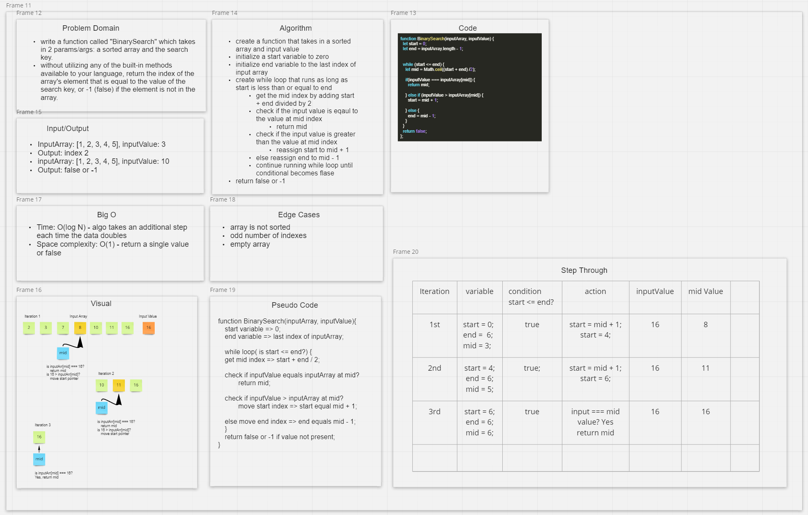

# Array Binary Search

## Feature Tasks

- Write a function called `arrayBinarySearch` which takes in 2 parameters: a sorted array and the search key.
- Without utilizing any of the built-in methods available to your language, return the index of the array's element that is equal to the value of the search key, or -1 (false) if the element is not in the array.

## Example

Input: `[4, 8, 15, 16, 23, 42], 15` Output: `2`
Input: `[-131, -82, 0, 27, 42, 68, 179], 42` Output: `4`
Input: `[11, 22, 33, 44, 55, 66, 77], 90` Output: `-1`
Input: `[1, 2, 3, 5, 6, 7], 4`  Output: `-1`

### Approach & Efficiency

- Initialize a `start` and `end` variable - `start` will represent the zero index of the input array, `end` will represent the last index of the input array.
- Initialize a `mid` variable and find the midpoint of the input array by using `Math.floor((start + end) /2)`
- Enter a while loop that remains true as long as `start <= end`.
- check if the input value is equal to the value at midpoint index of the input array
  - If true, `return mid`
- check if input value is greater than the value at midpoint of the input array
  - If true, assign the `start` to equal `mid + 1`, thus getting rid of the entire left half of the input array
- If both of those checks are false, we default to the last logic in the while loop
  - assign the `end` variable to equal `mid - 1`, thus getting rid of the entire right half of the input array
- continue until `input value` is equal to the value at midpoint index of the input array
- If the value is not present, we will eventually break out of the `while loop` and return `false` or `-1`

### Big O notation

- Time: O(log N) - the algorithm takes an additional step each time the data doubles.
- Space: O(1) - we're just returning `boolean` or `-1`, so our space in memory will remain constant.

### Whiteboard

