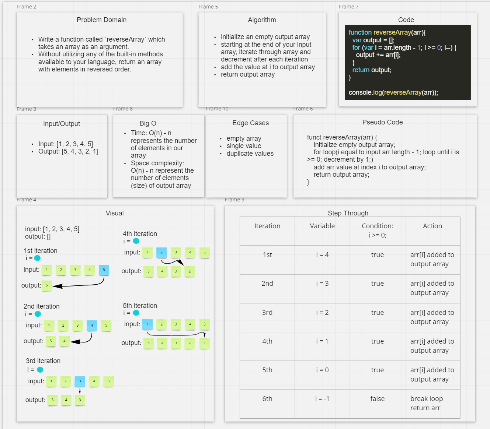

# Array Reverse

## Feature Tasks

- Write a function called `reverseArray` which takes an array as an argument.
- Without utilizing any of the built-in methods available to your language, return an array with elements in reversed order.

## Example

Input `[1, 2, 3, 4, 5]` Output `[5, 4, 3, 2, 1]`
Input `[89, 2354, 3546, 23, 10, -923, 823, -12]`  Output `[-12, 823, -923, 10, 23, 3546, 2354, 89]`

### Approach & Efficiency

- initialize an empty output array
- start for loop iteration at the last index of input array, continue until i is greater than or eqaul to zero, decrement by 1 after each iteration
- add value at index i to output array after each iteration
- return output array

### Big O notation

- Time: O(n)
- Space: O(n)

