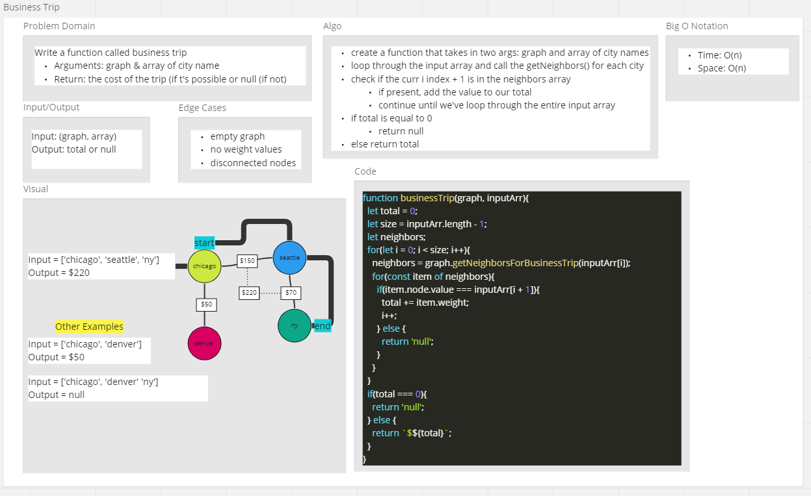

# Code Challenge - Business Trip

## Feature Tasks

Determine whether the trip is possible with direct flights, and how much it would cost.

- Write a function call business trip
- Arguments: graph, array of city names
- Returns: the cost of the trip (if it's possible)  or null (if it's not possible).

## Approach & Efficiency

- Loop through the list of city names
- for each city name, call the `getNeighbors(city name)` method
- check if the next city in the input array exist in the neighbors array
- add the value to the total
- After the loop, if total is equal to 0, return null
- If total is not equal to 0, return the total.

### Big O

- Time: O(n^2)
- Space: O(n)

## Whiteboard

