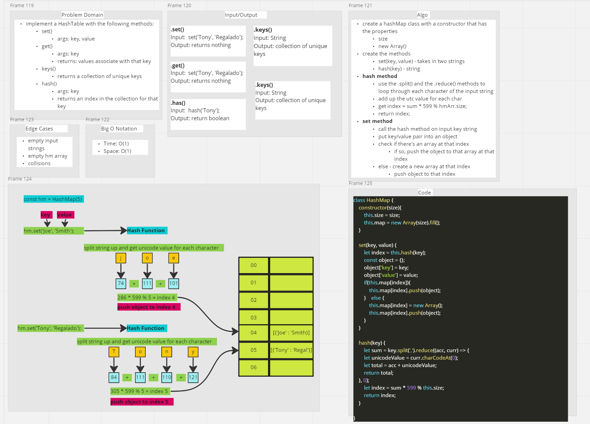

# Implementation: Hash Tables

- "A hash table, also known as hash map, is a data structure that implements an associative array or dictionary. It is an abstract data type that maps keys to values. A hash table uses a hash function to compute an index, also called a hash code, into an array of buckets or slots, from which the desired value can be found. During lookup, the key is hashed and the resulting hash indicates where the corresponding value is stored."

## Challenge Setup & Execution

- Branch Name: `hashtable`
- Challenge Type: New Implementation

## Approach & Efficiency

## API

- `set(key, value)`
  - adds a new key value pair to the hash table

- `get(key)`
  - returns the value if the key exists in the hash table

- `has(key)`
  - returns a boolean if the key exists in the hash table

- `keys()`
  - returns a list of all unique keys in the hash table

- `hash(key)`
  - hashes a string into a random index used for the set method

### Big O

- `set()`
  - Time: O(1)
  - Space: O(1)

- `get()`
  - Time: O(1)
  - Space: O(1)

- `has()`
  - Time: O(1)
  - Space: O(1)

- `keys()`
  - Time: O(n)
  - Space: O(n)

- `hash()`
  - Time: O(1)
  - Space: O(1)

### Methods

- `set(key, value)`
  - Arguments: key, value
  - Returns: Nothing
  - This method should has the key, and set the key and value pair in the table, handling collisions as needed
  - Should a given key already exist in the table, replace its value form the `value` argument given to this method

- `get(key)`
  - Arguments: key
  - Returns: VAlue associated with that key in the table

- `has(key)`
  - Arguments: key
  - Returns: Boolean, indicating whether the key exists in the table already

- `keys()`
  - Returns: Collection of unique keys

- `hash(key)`
  - Arguments: key
  - Returns: Index in the collection for that key

## Whiteboard

  

### Collaboration & Credit

- Martha Q., Danny C., Sarah T.
