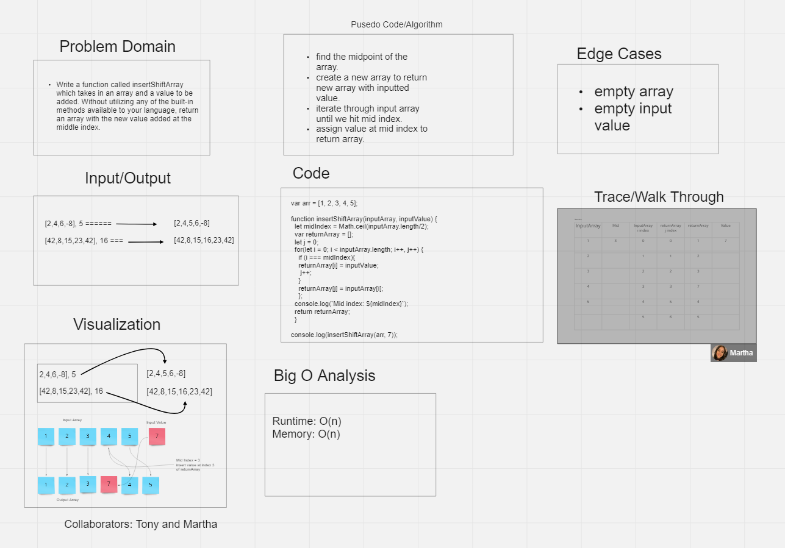

# Insert Array Shift

## Feature Tasks

- Write a function called `insertShiftArray` which takes an array and a value to be added.
- Without using any built-in methods available to your language, return an array with the new value added at the middle index.

## Example

InputArray `[1, 2, 3, 4, 5]`, InputValue: `7`, Output `[1, 2, 3, 7, 4, 5]`
InputArray `[8, 4, 25, 10, 9, 31]`, InputValue: `1`, Output `[8, 4, 25, 1, 10, 9, 31]`

### Approach & Efficiency

- find middle index of inputArray
- initialize an empty returnArray
- initialize a j counter.
- i will track inputArray index, j will track returnArray index
- start for loop iteration
    - check if i is equal midIndex
    - once i is equal to middle index, assign returnArray at index i equal to inputValue and increment j by 1;
  - set returnArray at index j equal to inputArray at index i
- return the returnArray

### Big O notation

- Time: O(n)
- Space: O(n)

## Collaboration

- Martha Quintanilla-Ramirez
