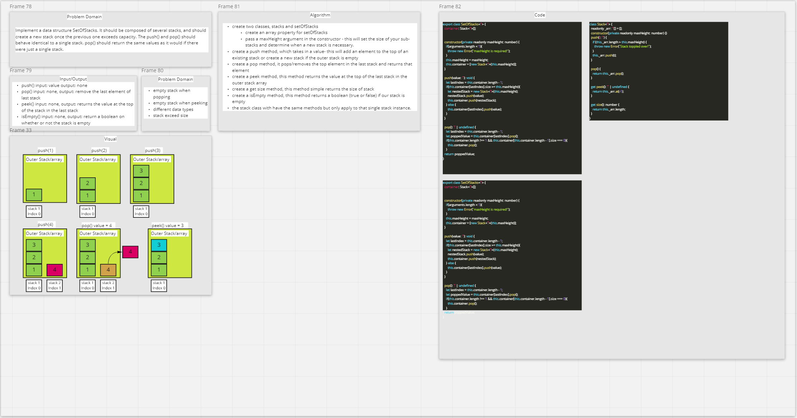

# Set of Stacks

- create a stack data structure that will create additional stack if the previous stack exceeds a particular size.
- pushing and popping from this stack should function as it normally would in a regular stack and `pop()` should return the last value in the last stack.

## Methods API

### push

- `push(value)`
  - inserts a new node at the top of the stack

### pop

- `pop()`
  - removes the last value in the last stack

### peek

- `peek()`
  - returns the last value in the last stack

### size

- `size()`
  - returns the size of all nodes in all stacks

### isEmpty

- `isEmpty()`
  - returns a boolean if the stack is empty

## Approach & Efficiency

- `.push()`
  - Time: O(1)
  - Space: O(1)

- `.pop()`
  - Time: O(1)
  - Space: O(1)

- `.peek()`
  - Time: O(1)
  - Space: O(1)

- `size()`
  - Time: O(1)
  - Space: O(1)

- `isEmpty()`
  - Time: O(1)
  - Space: O(1)

