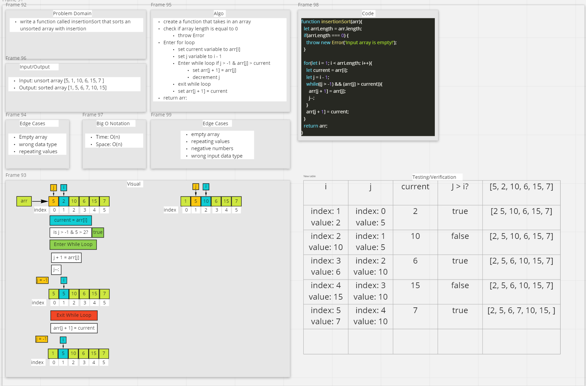

# Lab 26: Insertion Sort

- "Insertion sort iterates, consuming one input element each repetition, and grows a sorted output list. At each iteration, insertion sort removes one element from the input data, finds the location it belongs within the sorted list, and inserts it there. It repeats until no input elements remain."

- "Sorting is typically done in-place, by iterating up the array, growing the sorted list behind it. At each array-position, it checks the value there against the largest value in the sorted list (which happens to be next to it, in the previous array-position checked). If larger, it leaves the element in place and moves to the next. If smaller, it finds the correct position within the sorted list, shifts all the larger values up to make a space, and inserts into that correct position."

## Blog Post

### [Link](./insertion-sort/blog.md)

## Challenge

- Review the pseudocode below, then trace the algorithm by stepping through the process with the provided sample array. Document your explanation by creating a blog article that shows the step-by-step output after each iteration through some sort of visual.

### Pseudo Code

```
  InsertionSort(int[] arr)

    FOR i = 1 to arr.length

      int j <-- i - 1
      int temp <-- arr[i]

      WHILE j >= 0 AND temp < arr[j]
        arr[j + 1] <-- arr[j]
        j <-- j - 1

      arr[j + 1] <-- temp
```

### Approach & Efficiency

### API

- `insertionSort(arr)`
  - sorts an unsorted array

#### Big O

- insertionSort:
  - Time: O(n^2)
  - Space: O(1)

### Sources

[Wikipedia](https://en.wikipedia.org/wiki/Insertion_sort)

### Collabs

- Danny C. Martha Q, Sarah T



# Lab 27: Merge Sort

- Conceptually, a merge sort works as follows:

  - Divide the unsorted list into n sublists, each containing one element (a list of one element is considered sorted).
  - Repeatedly merge sublists to produce new sorted sublists until there is only one sublist remaining. This will be the sorted list.

## Blog Post

### [Link](./merge-sort/blog.md)

## Challenge

- Review the pseudocode below, then trace the algorithm by stepping through the process with the provided sample array. Document your explanation by creating a blog article that shows the step-by-step output after each iteration through some sort of visual.

### Pseudo Code

```
ALGORITHM Mergesort(arr)
    DECLARE n <-- arr.length

    if n > 1
      DECLARE mid <-- n/2
      DECLARE left <-- arr[0...mid]
      DECLARE right <-- arr[mid...n]
      // sort the left side
      Mergesort(left)
      // sort the right side
      Mergesort(right)
      // merge the sorted left and right sides together
      Merge(left, right, arr)

ALGORITHM Merge(left, right, arr)
    DECLARE i <-- 0
    DECLARE j <-- 0
    DECLARE k <-- 0

    while i < left.length && j < right.length
        if left[i] <= right[j]
            arr[k] <-- left[i]
            i <-- i + 1
        else
            arr[k] <-- right[j]
            j <-- j + 1

        k <-- k + 1

    if i = left.length
       set remaining entries in arr to remaining values in right
    else
       set remaining entries in arr to remaining values in left

```

### Sources

[Wikipedia](https://en.wikipedia.org/wiki/Merge_sort)

### Collabs

- Danny C. Martha Q, Sarah T
