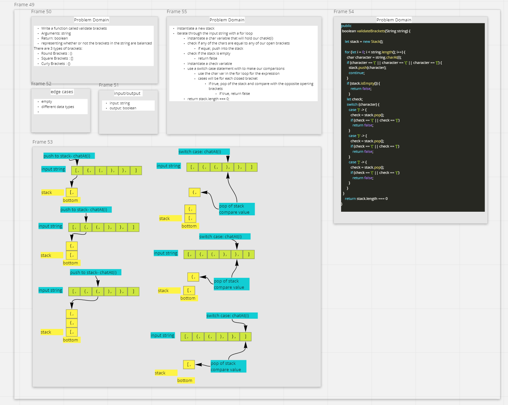

# Stack Queue Brackets

- Write a function call validate brackets

### balancedBrackets

- Arguments: string
- Return: boolean
  - represents true or false if the brackets in the string are balanced.

## Approach & Efficiency

- `balancedBrackets()`
  - Time: O(n)
  - Space: O(1)

## Testing

- Write unit tests

### Collaboration

- Martha Q.

## Whiteboard

