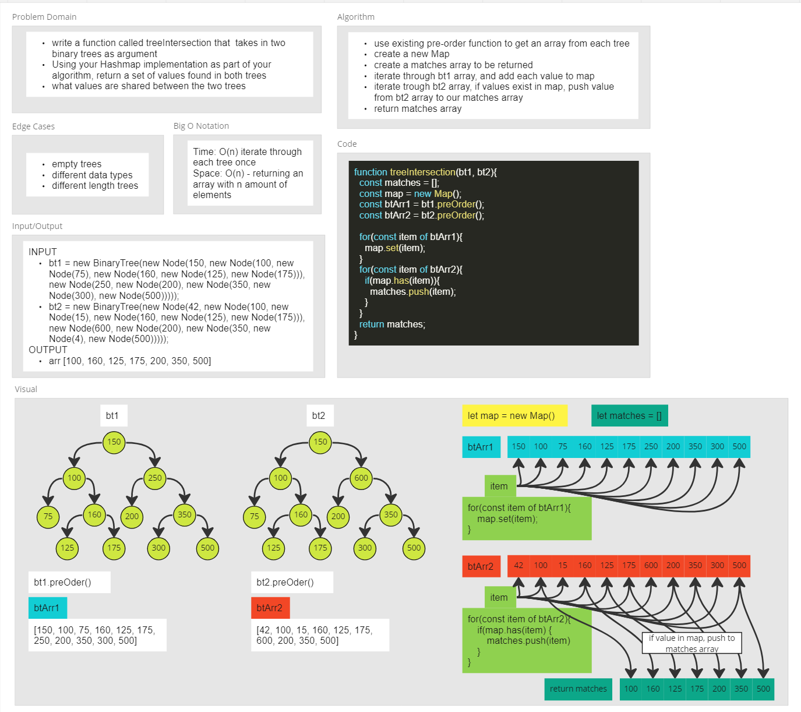

# Code Challenge - Tree Intersection

- A tree intersection means the same value is found in both binary trees.

## Feature Tasks

- write a function call `tree-intersection` that takes in two binary trees as parameter.
- Using your HashMap implementation as part of your algorithm, return a set of values found in both trees.

### Approach & Efficiency

- create a function that takes in two binary trees as parameters
- create an array that stores the matching values in both trees - lets call this array matches
- create a new hashMap that will store the values on the first tree
- run a pre-order, post-order or in-order method on each tree and save each to a variable (bt1Arr & bt2Arr) - the built-in pre, post and in order function return arrays
- run a for loop on bt1Arr and add these values to the hashMap
- run a for loop on bt2Arr, use the .has() method for each item in arr2
  - if the item exist in the hashMap, push this value to our matches array
- return matches array

### Big O

- Time: O(n)
- Space: O(n)

### API

- treeIntersection(bt1, bt2)
  - Arguments: two binary trees
  - Returns: empty array, array of values that exist in each tree or throw an exception

### Whiteboard

