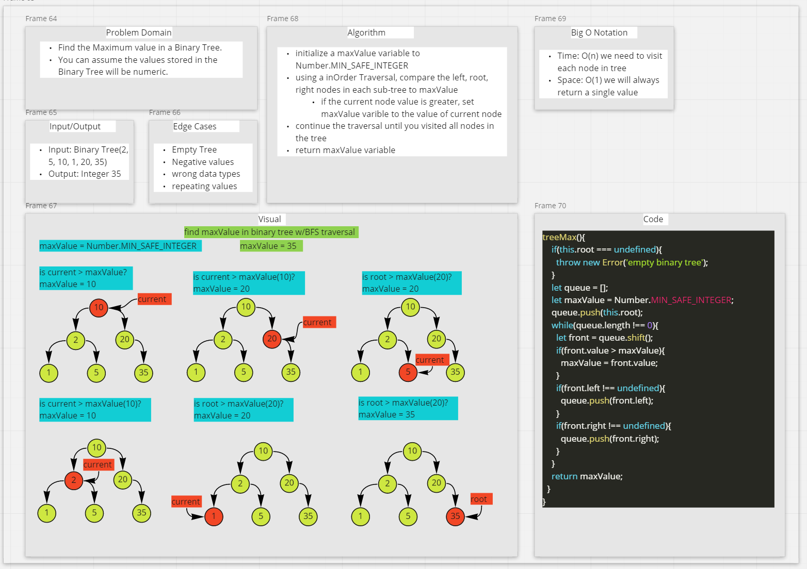

# Implementation: Trees

- "A binary tree is a tree data structure in which each node has at most two children, whihc are referred to as the left child and the right child.

## Node

- Create a `Node` class that has properties for the values stored in the Node, and left and right children nodes.

## Binary Tree

- Create a `Binary Tree` class
  - Define a method for each of the depth first traversals:
    - pre order
    - in order
    - post order which returns an array of teh values, ordered appropriately

## Binary Search Tree

- Create a `Binary Search Tree` class
  - This class should be a sub-class of the `Binary Tree` class, with the following methods:
    - Add
      - Argument: value
      - Returns: nothing
      - Adds a new node with that value in the correct location in the binary search tree
    - Contains
      - Argument: value
      - Returns: boolean indicating whether or not the value is in the tree at least once.

## Methods

### add()

- Argument: value
  - Returns: nothing
  - Adds a new node with that value in the correct location in the binary search tree

### contains()

- Contains
  - Argument: value
  - Returns: boolean indicating whether or not the value is in the tree at least once.

### maxValue()

- Argument: none
- Returns: largest value in the binary tree

## Approach & Efficiency

- `.add(value)`
  - Time: O(n)
  - Space: O(1)

- `.contains(values)`
  - Time: O(n)
  - Space: O(1)

- `.maxValue()`
  - Time: O(n)
  - Space: O(1)

## API

- `.add(value)`
  - inserts a new node with that values in the correct location in the binary_search_tree

- `.contains(values)`
  - returns boolean indicating whether or not the value is in the tree at least once

- `.maxValue()`
  - returns largest values in the binary tree

## Structure and Testing

1. Can successfully instantiate an empty tree
2. Can successfully instantiate a tree with a single root node
3. For a Binary Search Tree, can successfully add a left child and right child properly to a node
4. Can successfully return a collection from a pre-order traversal
5. Can successfully return a collection from an in-order traversal
6. Can successfully return a collection from a post-order traversal
7. Returns true	false for the contains method, given an existing or non-existing node value

### Whiteboard

