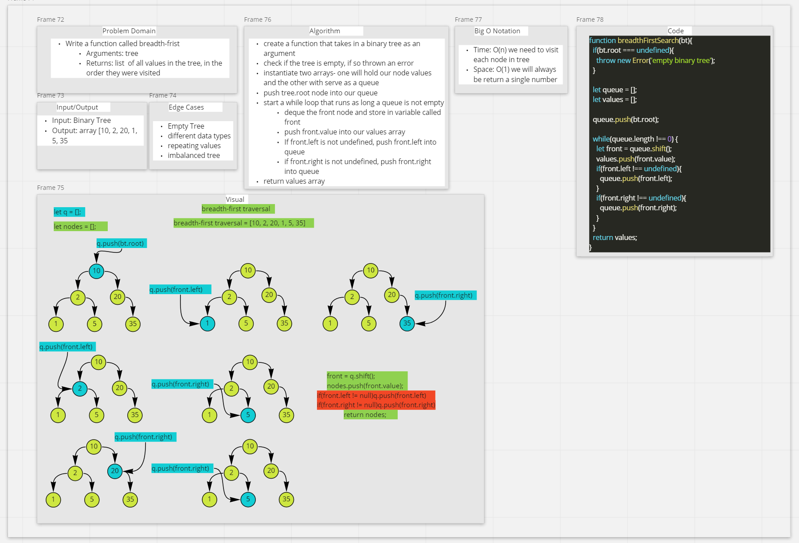

# Code Challenge - Breadth First Search

- Traverse the input tree using a Breadth-First approach

## Feature Tasks

- Write a function called breadth-first
  - Arguments: tree
  - Returns: list of all values in the tree, in the order they were encountered

### Function

- `breadthFirstSearch(tree)`
  - If the input tree's root is `undefined`, throw an error
  - create a values array that will hold our node values
  - create a queue, which operates on FIFO principle and will temporarily hold our nodes as we traverse the tree
  - If the queue is not empty, dequeue the front node and push the value into our return array
  - If the front.left is not undefined, enqueue front.left
  - If the front.right is not undefined, enqueue front.right
  - return values array

## Approach & Efficiency

- Big O Notation
  - Time: O(n)
  - Space: O(n)

### Whiteboard

