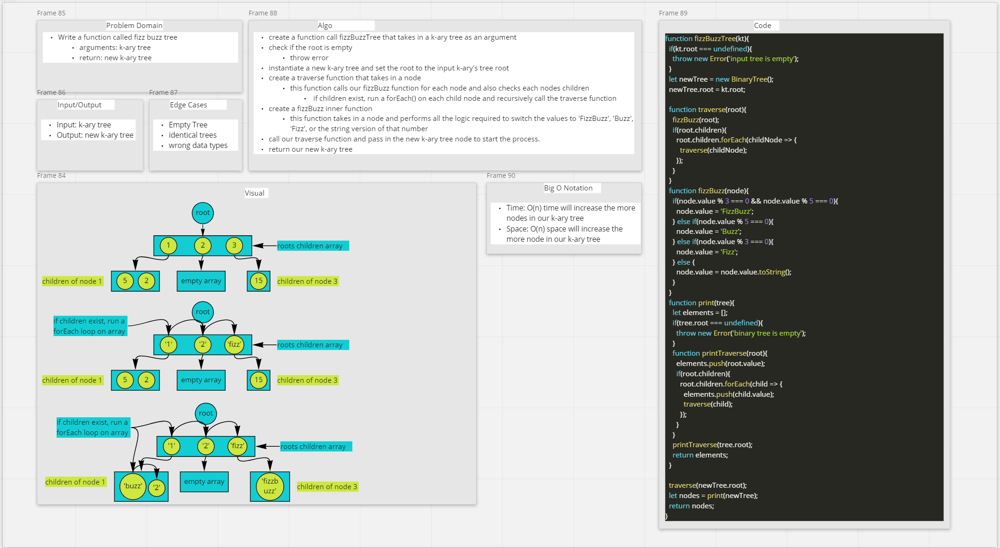

# Code Challenge - Tree Fizz Buzz

- Conduct a "FizzBuzz" on a k-ary tree while traversing through it to create a new tree
- Set the values of each of the new nodes depending on the corresponding node value in the source tree

## Feature Tasks

- Write a function called fizz buzz tree
  - Arguments: k-ary tree
  - Returns: k-ary tree

Determine whether or not the value of each node is divisible by 3, 5 or both. Create a new tree with teh same structure as the original, but with the values modified as follows:

- If the value is divisible by 3, replace the value with 'Fiz'
- If the value is divisible by 5, replace the value with 'Buzz'
- If the value is divisible by 3 & 5, replace the value with 'FizzBuzz'
- If the value is not divisible by 3 or 5, simply turn the number into a string

## Approach & Efficiency

- Big O Notation
  - Time: O(n)
  - Space: O(n)

### Whiteboard

