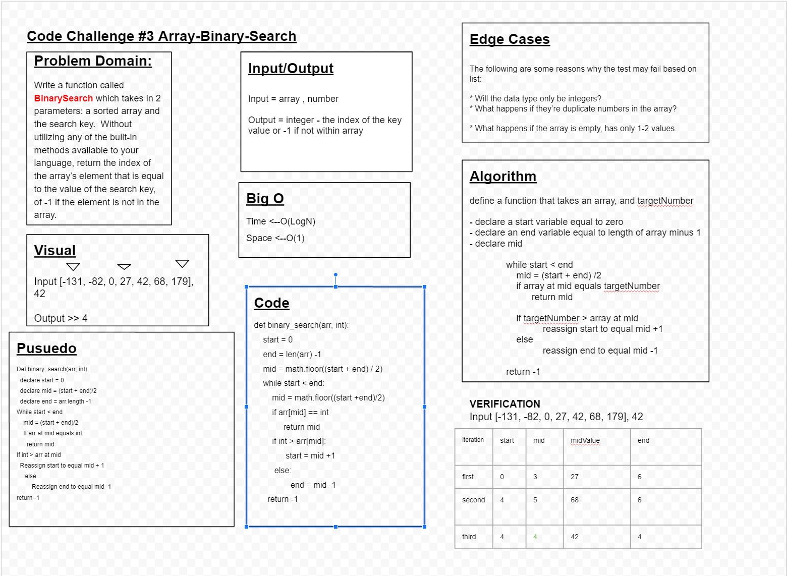

# Array-Binary-Search

## Whiteboard Process

## Problem Domain
-Write a function called binary_search which takes in 2 parameters: a sorted array and the search key. Without utilizing any of the built-in methods available to your language, return the index of the array's element that is equal to the value of the search key, or -1 if the element is not in the array.

## Input/Output
-Input = array, number
-Output = integer - the index of teh key value or -1 if not within array

## Edge Cases
-The following are some reasons why the test may fail base:
-Will the data type only be integers?
-What happens if they're duplicate numbers in the array?
-What happens if the array is empty or has only 1-2 values?

## Visual
-Input[-131, -82, 0, 27, 42, 68, 179], 42
-Output>>4

## Big O
-Time<--O(LogN)
-Space <--O(1)

## Algorithm
-define a function that takes an array and targetNumber
-declare a start variable eqaul to zero
-declare an end variable eqaul to lenght of array minus 1
-declare a mid variable

        while start < end>
         mid = (start + end)/2
         if array at mid eqauls targetNumber
            return mid
        if targetNumber > array at mid
            reassign start to eqaul mid +1
        else
            reassign end to eqaul to mid -1
        return -1

## Psuedo
def binary_search(arr, int)
    declare start = 0
    declare mid = (start + end)/2
  while start < end
    mid = (start + end)/2
    if arr at mid eqauls int
    return mid
  if int > arr at mid
    reassign start to eqaul to mid + 1
  else
    resassign end to eqaul to mid -1
return -1

## Code
def binary_search(arr, int):
    start = 0
    end = len(arr) -1
    mid = math.floor((start + end) / 2)
    while start < end:
        mid = math.floor((start +end)/2)
        if arr[mid] == int
             return mid
        if int > arr[mid]:
              start = mid +1
         else:
	          end = mid -1
    return -1

## Verification
-Input [-131, -82, 0, 27, 42, 68, 179], 42
Iteration  start  mid   midValue  end
1st        0      3     27        6
2nd        4      5     68        6
3rd        4      4     42        4

## Approach & Efficiency
-we declared start, end and mid variables. In a while loop, we check if the mid value matches the int value. If it doesn't, we update our start and end variables to splits the array into halves, until start < end. Once arr[mid] === val, we return mid. If the while loop completes without locatin ga match for the target int, we return -1.
-This solution has a time/space efficiency of O(logN).

## Collabs
- Davee Sok
