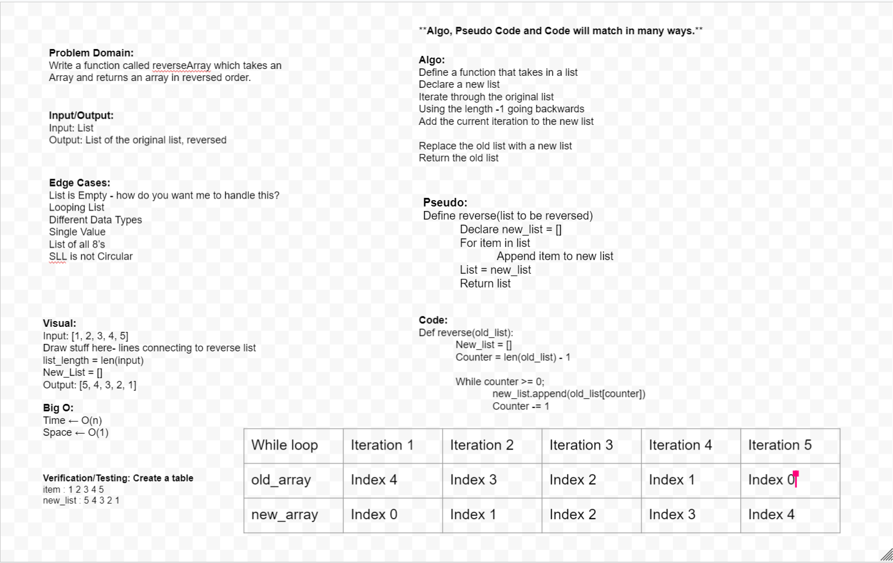

# Reverse an Array

Write a function called reverseArray which takes an array as an agrument. Without utilizing any of the built-in methods available to your language, return an array with elements in reversed order.

## Whiteboard Process

## Approach & Efficiency

We used a while loop to iterate through our list and return the last index to a new list.