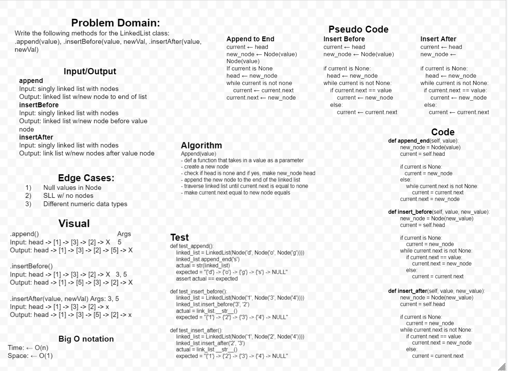
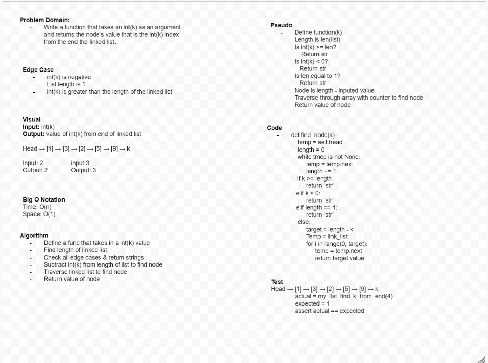
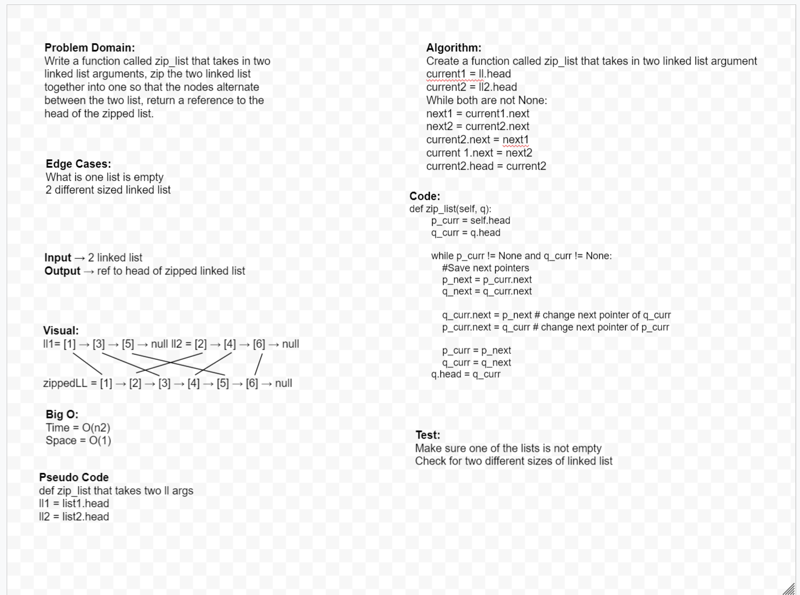

# Code Challenge #5: Singly Linked List

* Create a Node class that has properties for the value stored in the Node, and a pointer to the next Node.
* Within your LinkedList class, include a head property. Upon instantiation, an empty Linked List should be created.
* Define a method called insert which takes any value as an argument and adds a new node with that value to the head of the list with an O(1) Time performance.
* Define a method called includes which takes any value as an argument and returns a boolean result depending on whether that value exists as a Node’s value somewhere within the list.
* Define a method called toString (or __str__ in Python) which takes in no arguments and returns a string representing all the values in the Linked List, formatted as:
"{ a } -> { b } -> { c } -> NULL"
* Any exceptions or errors that come from your code should be semantic, capturable errors. For example, rather than a default error thrown by your language, your code should raise/throw a custom, semantic error that describes what went wrong in calling the methods you wrote for this lab.
* Be sure to follow your language/frameworks standard naming conventions (e.g. C# uses PascalCasing for all method and class names).

## Approach & Efficiency

## API

## Code Challenge 06: Linked List Insertions

Extend a Linked List to allow various insertions methods
* .append(value) which adds a new node with the given value to the end of the list
* .insertBefore(value, newVal) which add a new node with the given newValue immediately before the first value node
* .insertAfter(value, newVal) which add a new node with the given newValue immediately after the first value node

## Whiteboard Process

## Approach & Efficiency

## Collabs and Credit

I woked on this Code Challenge with Daniel Dills.
TA assistance from Athony Beaver.

## Code Challenge 07: Linked List Kth

* argument: a number, k, as a parameter.
* Return the node’s value that is k places from the tail of the linked list.
* You have access to the Node class and all the properties on the Linked List class as well as the methods created in previous challenges.

## Whiteboard Process

## Collabs and Credit

I woked on this Code Challenge with Anthony Wiliams and Michael Hendrix.

## Code Challenge 08: Linked List Zipped

* Write a function called zip lists
* Arguments: 2 linked lists
* Return: Linked List, zipped as noted below
* Zip the two linked lists together into one so that the nodes alternate between the two lists and return a reference to the head of the zipped list.
* Try and keep additional space down to O(1)
* You have access to the Node class and all the properties on the Linked List class as well as the methods created in previous challenges.

## Collabs and Credit
I worked on this Code Challenge with Wondwosen
TA help from Ben Hill and Anthony Beaver

