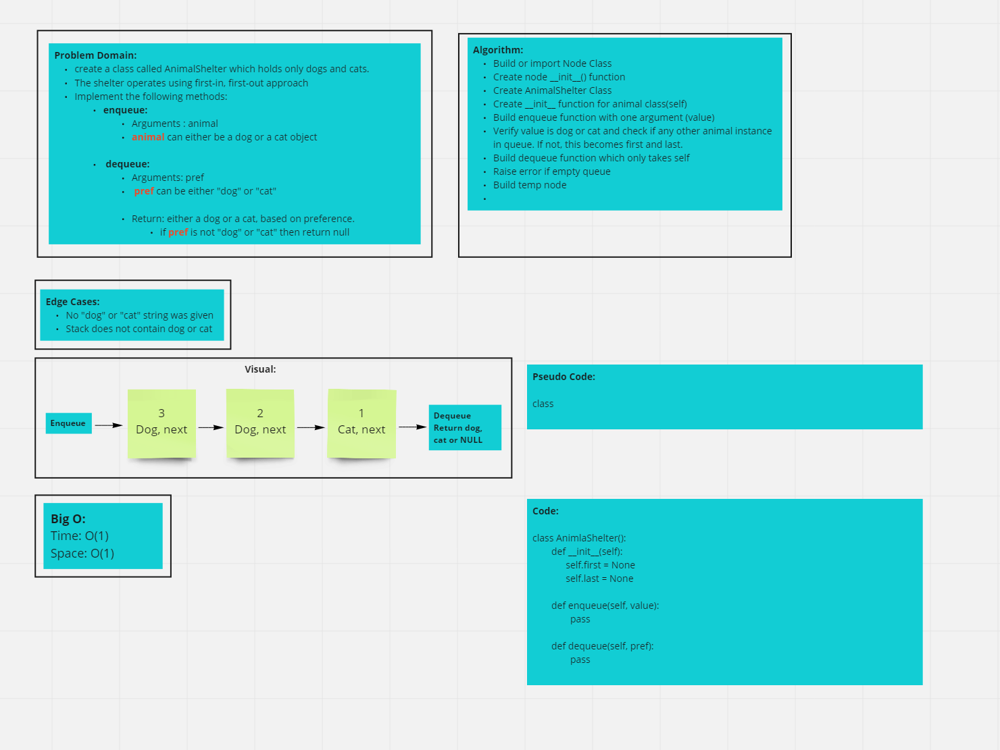

# Stacks and Queues
Create an AnimalShelter class which holds cats and dogs utilizing the FIFO approach.
## Challenge
<!-- Description of the challenge -->

## Whiteboard

## Approach & Efficiency
<!-- What approach did you take? Why? What is the Big O space/time for this approach? -->

## API
<!-- Description of each method publicly available to your Stack and Queue-->
