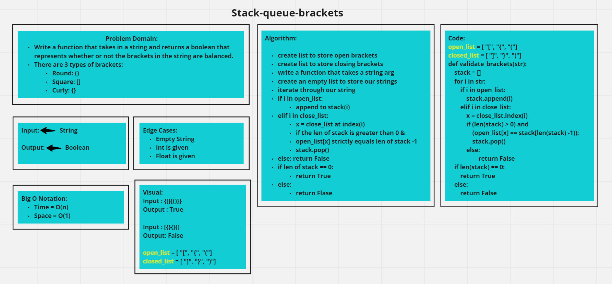

# Code Challenge: 13 Stack-queue-brackets

# Collab:
- Garfield Grant, Kevin Henry and Anthony Williams
- TA help: Anthony Beaver

## Challenge
- Write a function called validate brackets
- Arguments: string
- Return: boolean that represents whether or not the brackets in the string are balanced.
- There are 3 types of brackets:
- Round Brackets: `()`
- Square Brackets: `[]`
- Curly Brackets: `{}`

## Big 0

- Time: O(n)
- Space: O(1)

## Whiteboard

## Approach & Efficiency
- We used stack to check is the brackets are balanced. Each time a bracket is encountered, push it to the stack, and when a closed matching bracket is encountered, match it with the top of the stack and pop it. If stack is empty at the end, return True, else False.

## API
<!-- Description of each method publicly available to your Stack and Queue-->
