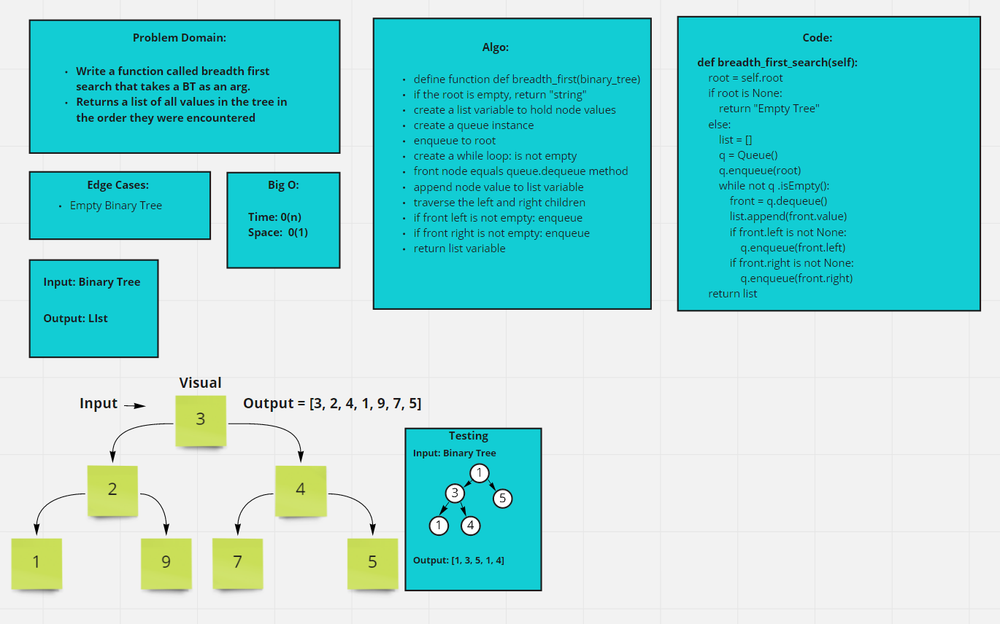

# Code Challenge: 17 Tree Breadth First

# Collab:

- Kassie Bradshaw

## Challenge

- Write a function called breadth first
- Arugment: tree
- Return: list of all values in the tree in the order they were encountered
- Note: traverse the input tree using a Breadth-first approach

## Big 0

- Time: O(n)
- Space: O(1)

## Whiteboard

## Approach & Efficiency

## API
<!-- Description of each method publicly available to your Stack and Queue-->
