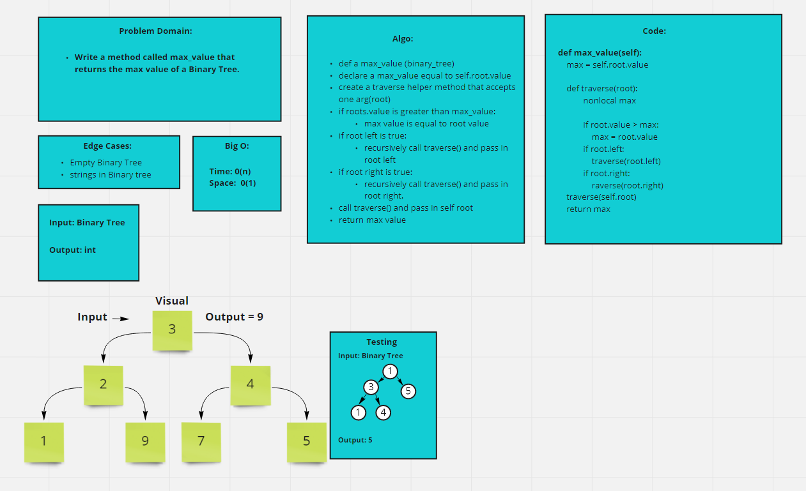

# Code Challenge: 16 Tree Max Value in Binary Tree

- find the Max Value in a Binary Tree

### Feature Tasks

- Write the following method for the Binary Tree Class
    - find the max value
        - Arguments: none
        - Returns: number

## Collaboration & Credit

- Kevin Henry

//////////////////////////////////////////////////////////////////

# Code Challenge: 17 Tree Breadth First

- Write a function called breadth first
- Arugment: tree
- Return: list of all values in the tree in the order they were encountered
- Note: traverse the input tree using a Breadth-first approach

## Big 0

- Time: O(n)
- Space: O(1)

## Whiteboard

# Collab & Credit:

- Kassie Bradshaw

